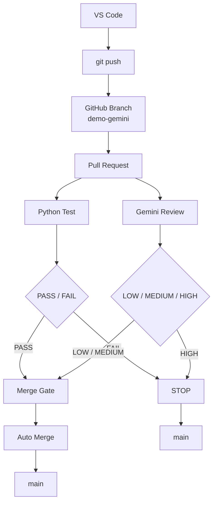

# PR / Merge Flow

這是一個從分支推送到主分支的流程說明。

## 流程圖

## 流程說明

1. 在 VS Code 中修改程式碼。
2. 執行 git push，將變更推送到 GitHub 分支。
3. 建立 Pull Request。
4. 進行 Python 測試與 Gemini Review。
5. 若結果為 PASS 且風險為 LOW / MEDIUM，則進入自動合併。
6. 若測試失敗或風險為 HIGH，則停止流程。

## 判斷規則

- Python Test: PASS / FAIL
- Gemini Review: LOW / MEDIUM / HIGH
- Merge Gate:
  - LOW / MEDIUM -> Auto Merge
  - HIGH -> STOP
